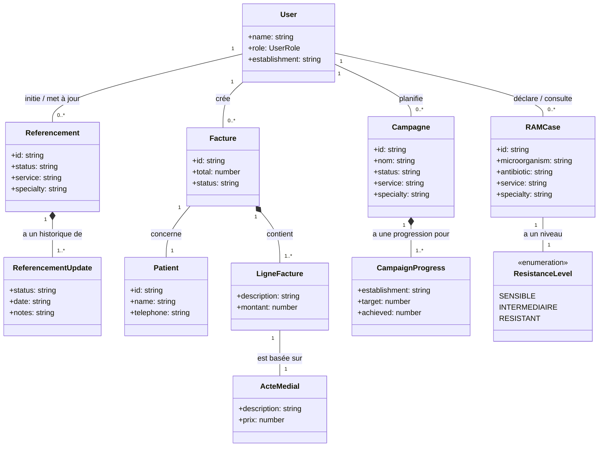
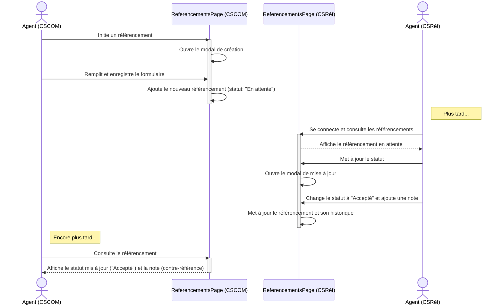
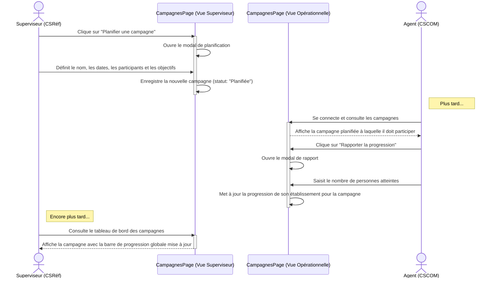
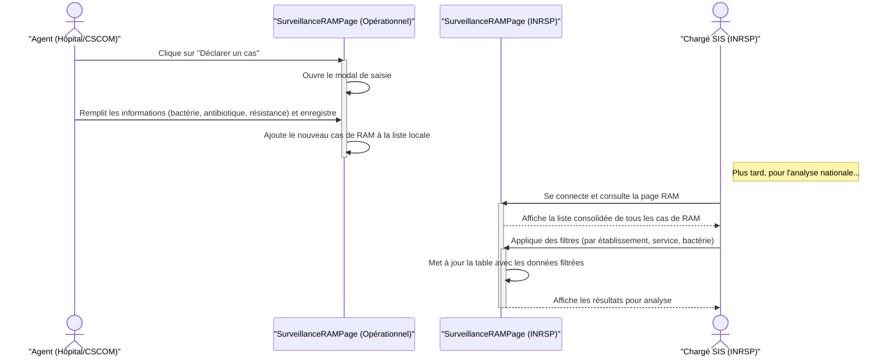

# 10. Diagrammes de Modélisation (UML)

## 10.1. Introduction

Cette section présente une modélisation formelle de l'application via des diagrammes UML. Ces diagrammes, générés avec la syntaxe **Mermaid**, ont été mis à jour pour refléter l'architecture actuelle, y compris les fonctionnalités de référencement, de facturation et de gestion des campagnes. Ils offrent une vue académique précise du système.

---

## 10.2. Diagramme de Cas d'Utilisation

Ce diagramme illustre les interactions entre les acteurs et les fonctionnalités clés, en intégrant les nouveaux modules.

**Acteurs :**
-   **Agent Opérationnel** : Personnel de terrain (`SIH`, `SIS_CSCOM`, `SIS_CABINET`).
-   **Coordinateur de District** : Rôle de supervision locale (`SIS_CSREF`, `ADMIN_LOCAL`).
-   **Superviseur National** : Vue d'ensemble de la plateforme (`SUPER_ADMIN`, `MINISTERE_SIS`, `SIS_INRSP`).

```mermaid
graph TD
    subgraph "Système d'Information Sanitaire (SIS)"
        direction LR
        
        subgraph "Gestion Clinique"
            UC1[Gérer Dossiers Patients]
            UC2[Gérer Consultations]
            UC3[Gérer Hospitalisations]
            UC4[Initier Référencement]
            UC5[Gérer Contre-Référence]
        end
        
        subgraph "Santé Publique & Coordination"
            UC6[Déclarer Cas Épidémiologiques]
            UC_RAM[Surveiller la RAM]
            UC7[Planifier Campagne]
            UC8[Participer à une Campagne]
            UC9[Évaluer Campagne]
        end
        
        subgraph "Gestion Administrative & Supervision"
            UC10[Gérer Facturation]
            UC11[Gérer Utilisateurs Locaux]
            UC12[Superviser Données Globales]
            UC13[Analyser Données Nationales]
        end
    end

    actor Agent as "Agent Opérationnel"
    actor Coordinateur as "Coordinateur de District"
    actor Superviseur as "Superviseur National"
    
    Coordinateur --|> Agent
    Superviseur --|> Coordinateur

    Agent --> UC1
    Agent --> UC2
    Agent --> UC3
    Agent --> UC4
    Agent --> UC6
    Agent --> UC_RAM
    Agent --> UC8
    Agent --> UC10
    
    Coordinateur --> UC5
    Coordinateur --> UC7
    Coordinateur --> UC9
    Coordinateur --> UC11

    Superviseur --> UC12
    Superviseur --> UC13
    UC13 -.-> UC_RAM : <<include>>
    UC13 -.-> UC6 : <<include>>
    
    UC5 -.-> UC4 : <<extend>>
    UC8 -.-> UC7 : <<include>>
    UC9 -.-> UC7 : <<include>>
```

---

## 10.3. Diagramme de Classes (Modèle de Données Enrichi)

Ce diagramme modélise les entités de données (`types.ts`) incluant les nouvelles structures pour les modules implémentés.



---

## 10.4. Diagrammes de Séquence

### 10.4.1. Séquence : Flux de Référencement et Contre-Référence

Ce diagramme montre le processus collaboratif entre un CSCOM et un CSRéf.



### 10.4.2. Séquence : Flux de Planification et Suivi d'une Campagne

Ce diagramme illustre la coordination entre un superviseur et un agent de terrain pour une campagne de santé publique.



### 10.4.3. Séquence : Flux de Surveillance de la RAM

Ce diagramme modélise le processus de déclaration d'un cas de RAM par un agent de terrain et sa consultation/analyse par un superviseur national.

