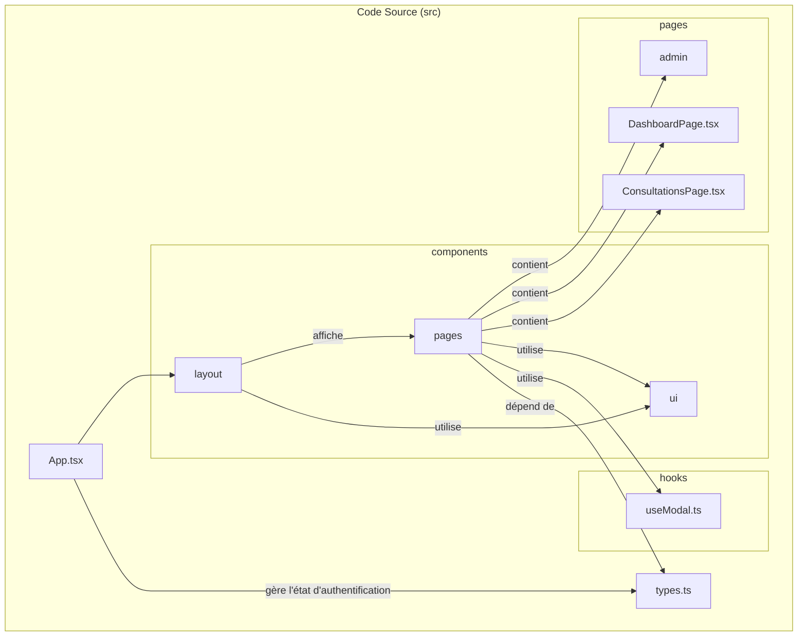
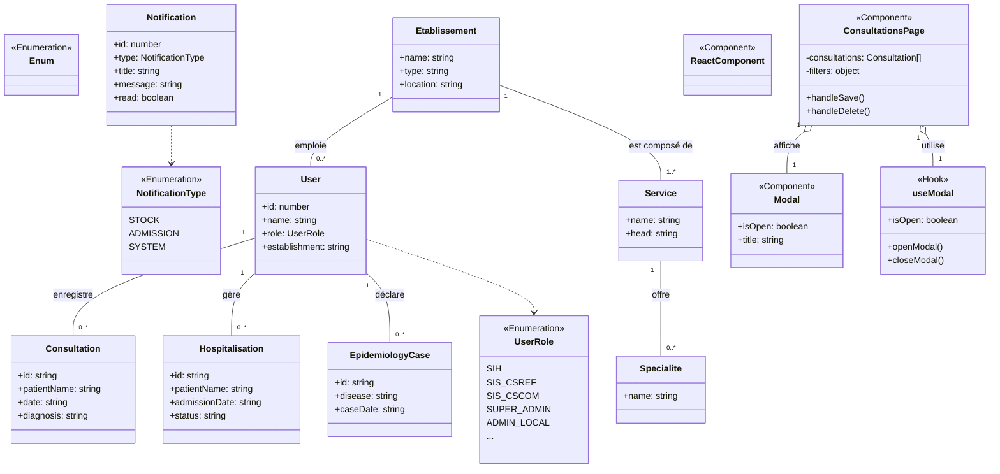
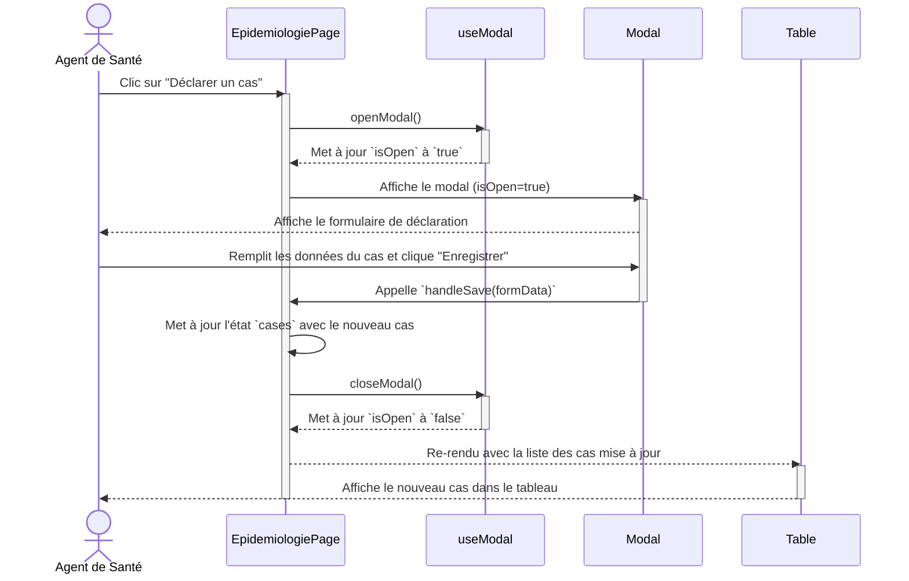
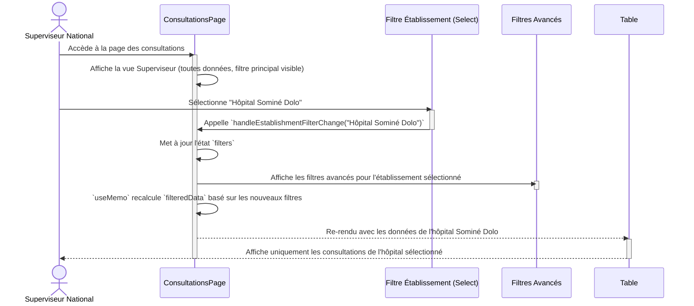

# 10. Diagrammes de Modélisation (UML)

## 10.1. Introduction

L'Unified Modeling Language (UML) est une norme de modélisation graphique utilisée en génie logiciel pour visualiser, spécifier, construire et documenter les artefacts d'un système. Les diagrammes suivants ont été créés en utilisant la syntaxe **Mermaid**, ce qui permet de les intégrer directement dans cette documentation Markdown. Ils offrent une vue formelle et académique de l'architecture, des fonctionnalités et des interactions au sein de l'application SIS.

---

## 10.2. Diagramme de Cas d'Utilisation

Ce diagramme illustre les interactions entre les acteurs (utilisateurs) et les fonctionnalités majeures du système, en respectant la pyramide sanitaire.

**Acteurs :**
-   **Agent de Santé** : Acteur général représentant le personnel de terrain (rôles `SIH`, `SIS_CSREF`, `SIS_CSCOM`, `SIS_CABINET`).
-   **Admin Local** : Acteur responsable de la configuration de son établissement.
-   **Superviseur National** : Acteur avec une vue globale sur le système (`SUPER_ADMIN`, `MINISTERE_SIS`).

```mermaid
graph TD
    subgraph "Système d'Information Sanitaire (SIS)"
        direction LR
        
        subgraph "Module Clinique"
            UC1[Gérer Dossiers Patients]
            UC2[Gérer Consultations]
            UC3[Gérer Hospitalisations]
            UC4[Gérer Référencements]
        end
        
        subgraph "Module Santé Publique"
            UC5[Déclarer Cas Épidémiologiques]
            UC6[Générer Rapports]
        end
        
        subgraph "Module Support"
            UC7[Gérer Ressources (Lits, Équipements)]
            UC8[Gérer Facturation]
            UC9[Consulter Tableau de Bord]
        end

        subgraph "Module Administration Locale"
            UC10[Gérer Utilisateurs de l'établissement]
            UC11[Configurer Services & Spécialités]
            UC12[Configurer Partage de Données]
        end
        
        subgraph "Module Supervision Nationale"
            UC13[Superviser Données Nationales]
            UC14[Gérer tous les Établissements]
            UC15[Gérer tous les Utilisateurs]
            UC16[Gérer Modules Applicatifs]
        end
    end

    actor Agent as Agent de Santé
    actor Admin as Admin Local
    actor Superviseur as Superviseur National

    Agent --|> Admin
    Admin --|> Superviseur

    Agent --> UC1
    Agent --> UC2
    Agent --> UC3
    Agent --> UC4
    Agent --> UC5
    Agent --> UC9
    
    Admin --> UC6
    Admin --> UC7
    Admin --> UC8
    Admin --> UC10
    Admin --> UC11
    Admin --> UC12

    Superviseur --> UC13
    Superviseur --> UC14
    Superviseur --> UC15
    Superviseur --> UC16
    
    UC2 -.-> UC1 : <<include>>
    UC3 -.-> UC1 : <<include>>
    UC15 -.-> UC10 : <<extend>>
```

---

## 10.3. Diagramme de Packages

Ce diagramme montre l'organisation du code source en modules logiques (packages) et leurs dépendances, reflétant la structure des dossiers dans `/src`.



---

## 10.4. Diagramme de Classes (Complet)

Ce diagramme modélise les entités de données (`types.ts`) ainsi que les principaux composants React, illustrant les relations entre la structure des données et l'interface utilisateur.



---

## 10.5. Diagrammes de Séquence

### 10.5.1. Séquence : Ajout d'une Déclaration Épidémiologique

Ce diagramme montre le flux d'interactions lorsqu'un agent de santé déclare un nouveau cas épidémiologique.



### 10.5.2. Séquence : Supervision des Données par un Administrateur National

Ce diagramme illustre comment un superviseur national filtre les consultations pour visualiser les données d'un établissement spécifique.


