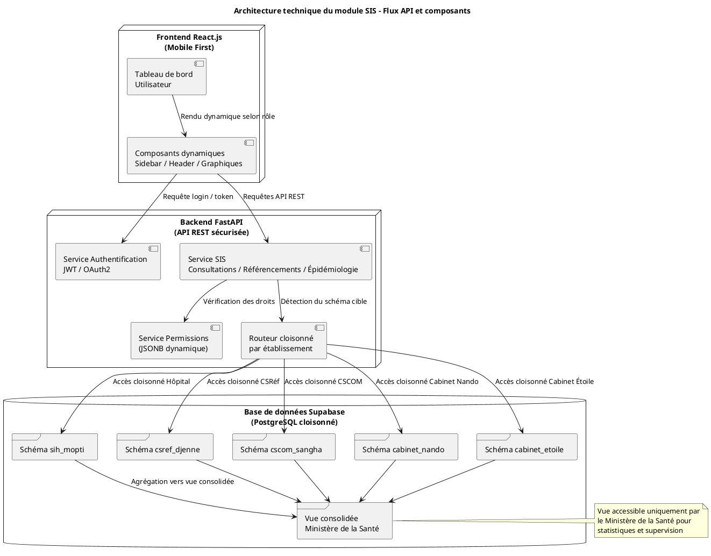

# 12. Architecture Technique et Communication Temps Réel

## 12.1. Vue d'ensemble de l'Architecture Technique

Ce diagramme PlantUML représente l'architecture full-stack cible pour le module SIS. Il illustre la séparation claire entre le frontend, le backend, et la base de données, ainsi que le flux de données et le principe de cloisonnement.

| Composant | Rôle technique |
| --- | --- |
| **Frontend React.js** | Interface utilisateur mobile-first, rendue dynamiquement selon rôle |
| **FastAPI Backend** | Authentification, permissions, API REST, cloisonnement par établissement |
| **Supabase PostgreSQL** | Stockage cloisonné par schéma, vue consolidée pour supervision ministérielle |
| **Vue consolidée** | Agrégation des données pour le Ministère de la Santé |

---

## 12.2. Mécanismes de Communication en Temps Réel

Pour une application sanitaire, la réactivité est cruciale. Voici les trois mécanismes envisagés pour assurer une communication dynamique entre le frontend et le backend.

### 1. **WebSocket** – Communication bidirectionnelle en temps réel

-   **Principe** : WebSocket établit une **connexion persistante** entre le client (React.js) et le serveur (FastAPI), permettant l’envoi et la réception de données en temps réel sans recharger la page.
-   **Cas d’usage dans SIS** :
    -   Notification instantanée d’un référencement ou d’un avis spécialisé.
    -   Mise à jour en direct des tableaux de bord (consultations, cas épidémiologiques).
    -   Alertes sanitaires (ex. : seuil de paludisme dépassé).

### 2. **Polling** – Interrogation périodique du serveur

-   **Principe** : Le client envoie des requêtes HTTP à intervalles réguliers pour vérifier si de nouvelles données sont disponibles.
-   **Cas d’usage dans SIS** :
    -   Mise à jour des statistiques toutes les X minutes.
    -   Vérification des nouveaux dossiers ou consultations.
    -   Alternative simple pour les zones à faible connectivité.

### 3. **Webhook** – Notification déclenchée par le serveur

-   **Principe** : Le serveur envoie une requête HTTP POST vers une URL cible lorsqu’un événement spécifique se produit. C'est un mécanisme principalement inter-serveurs.
-   **Cas d’usage dans SIS** :
    -   Transmission automatique d’un rapport vers le Ministère.
    -   Notification à un CSRéf lorsqu’un CSCOM référence un patient.
    -   Synchronisation inter-module (ex. : facturation ↔ dossier médical).

### Recommandation stratégique

| Mécanisme | Avantages | Limites | Recommandé pour… |
| --- | --- | --- | --- |
| **WebSocket** | Ultra-réactif, bidirectionnel | Complexité, dépendance connectivité | Notifications, alertes, chat |
| **Polling** | Simple à implémenter | Moins efficace, charge réseau | Statistiques, synchronisation lente |
| **Webhook** | Déclenchement précis, scalable | Nécessite endpoint récepteur | Rapports, inter-module, supervision |
